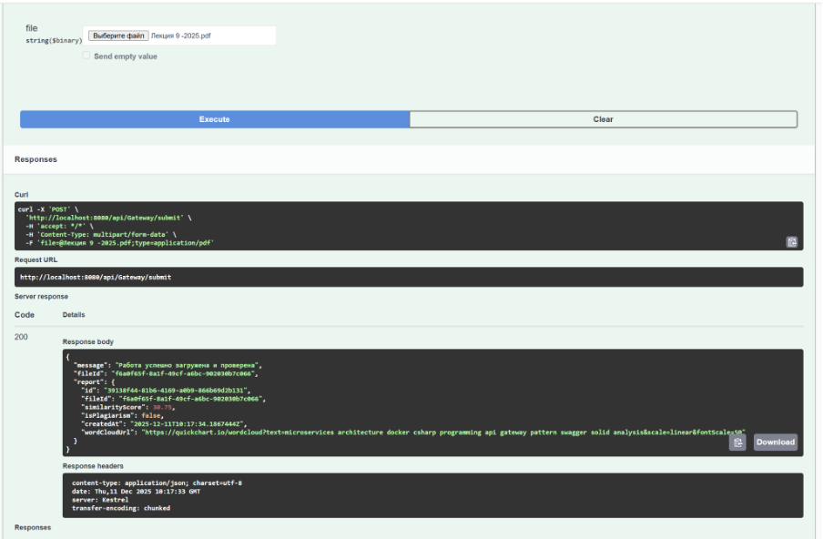
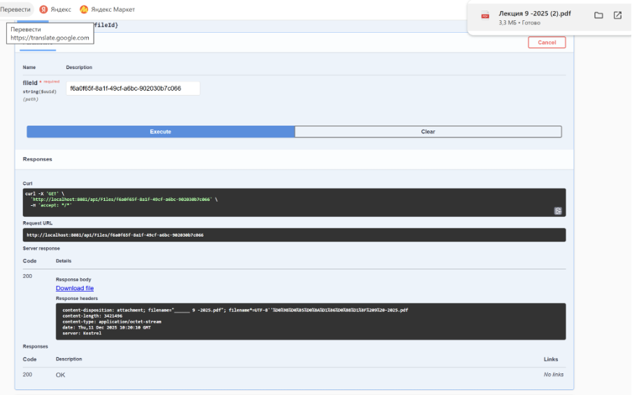
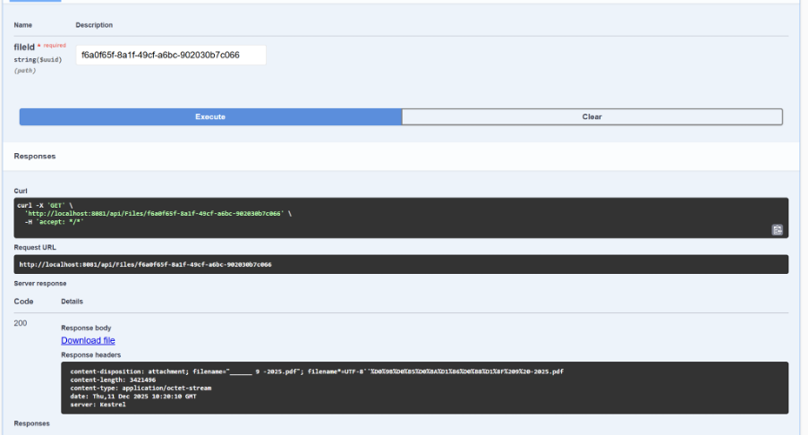
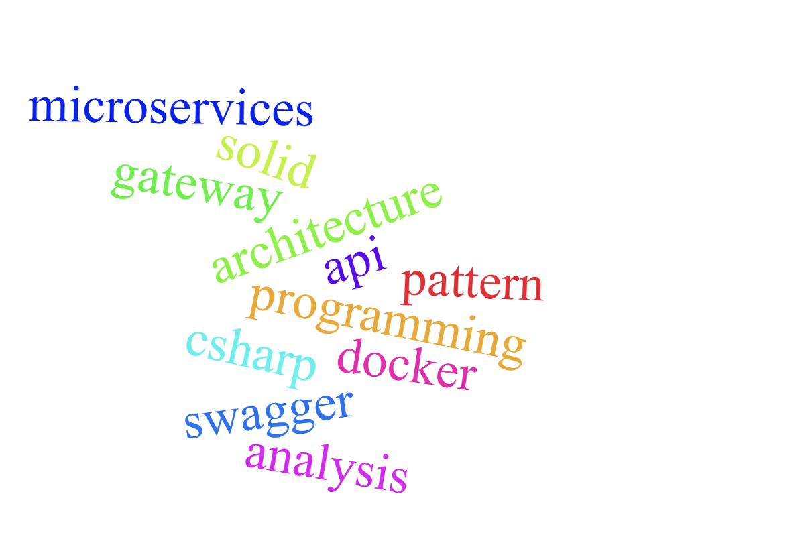

# КПО ДЗ_3 

Микросервисная система для загрузки, хранения и анализа файлов на плагиат с генерацией ссылки на облако слов. Проект разработан в рамках домашнего задания по курсу КПО.
## Функциональность

Проект реализует микросервисную архитектуру, состоящую из трех компонентов:
1.  **ApiGateway** — единая точка входа. Принимает файлы от пользователя, координирует процесс сохранения и анализа. Обрабатывает ошибки недоступности сервисов.
2.  **FileStorageService** — отвечает за физическое сохранение файлов на диск и управление метаданными.
3.  **FileAnalysisService** — имитирует проверку на плагиат, подсчитывает статистику слов и генерирует Облако слов (Word Cloud) с использованием внешнего API.

## Текнолоджия

*   **Платформа:** .NET 8 (C#)
*   **Архитектура:** Микросервисы
*   **Контейнеризация:** Docker
*   **Взаимодействие:** Синхронное (HTTP/REST via HttpClient)
*   **Документация:** Swagger (OpenAPI)
*   **Тестирование:** xUnit, AutoFixture, Moq

## Запуск проекта

Для запуска требуется установленный Docker Desktop.

1.  **Клонирование репозитория:**
    ```
    git clone https://github.com/sashamosk17/KPO_DZ3.git
    cd KPO_DZ3
    ```

2.  **Запуск через Docker Compose:**
    Выполните команду в корне проекта:
    ```
    docker-compose up --build
    ```
    *Эта команда соберет образы всех трех сервисов и запустит их в единой сети.*

## Как тестировать

После успешного запуска система доступна по адресам:

*   **ApiGateway (Точка входа):** [http://localhost:8080/swagger](http://localhost:8080/swagger)
*   *FileStorageService:* [http://localhost:8081/swagger](http://localhost:8081/swagger)
*   *FileAnalysisService:* [http://localhost:8082/swagger](http://localhost:8082/swagger)

### Сценарий проверки:
1.  Откройте Swagger ApiGateway: [http://localhost:8080/swagger](http://localhost:8080/swagger).
2.  Найдите метод **POST /api/processing/process**.
3.  Нажмите "Try it out" и выберите любой текстовый файл для загрузки.
4.  Нажмите **Execute**.
5.  В ответе вы получите JSON с результатами:
    *   ID сохраненного файла.
    *   Процент схожести (плагиат).
    *   Ссылку на **Word Cloud** (визуализацию).

## Соответствие требованиям

| Требование | Статус | Реализация |
| :--- | :---: | :--- |
| **Микросервисная архитектура** | + | Реализовано 3 независимых сервиса. |
| **Синхронное взаимодействие** | + | ApiGateway вызывает сервисы через `HttpClient`. |
| **Docker Compose** | + | Все сервисы запускаются одной командой. |
| **Обработка ошибок** | + | Gateway перехватывает исключения при падении любого сервиса. |
| **Swagger документация** | + | Доступна для всех сервисов. |
| **Визуализация (Word Cloud)** | + | Интеграция с API QuickChart.io. |
| **Unit-тесты** | + | Покрытие тестами FileAnalysisService. |

## Структура проекта

```KPO_DZ3/
├── ApiGateway/ # Оркестратор запросов
├── FileStorageService/ # Сервис хранения файлов
├── FileAnalysisService/ # Сервис анализа и генерации отчетов
├── FileAnalysisService.Tests/ # Модульные тесты
└── docker-compose.yml # Конфигурация Docker
```

### Скриншоты работы

**1. Пример успешной обработки файла через Swagger (ApiGateway):**


**2. Скачивание исходного загруженного файла из FileStorageService через Swagger:**


**3. Просмотр отчёта по загруженному файлу по его fileId:**


**4. Пример облака слов:**

